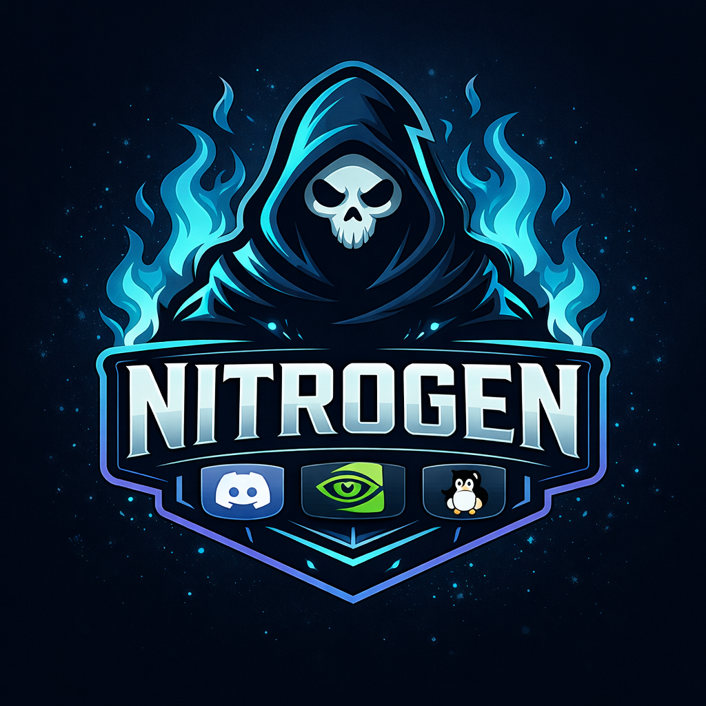

<h1 align="center">
  <br>
  
  <br>
  Nitrogen
  <br>
</h1>

<h4 align="center">Wayland-native NVIDIA streaming for Discord and friends.</h4>

> **Warning**
>
> Nitrogen is under active development. APIs and CLI options may change.
> Use in production at your own risk.

<p align="center">
  
  
  
  
  
</p>

<p align="center">
  
  
  
  
  
  
</p>

<p align="center">
  <a href="#features">Features</a> •
  <a href="#requirements">Requirements</a> •
  <a href="#installation">Installation</a> •
  <a href="#usage">Usage</a> •
  <a href="#how-it-works">How It Works</a> •
  <a href="docs/README.md">Docs</a>
</p>

---

## Features

<table>
<tr>
<td>

**🖥️ Wayland-Native**
- Works seamlessly with KDE Plasma 6
- Full Hyprland support
- Sway and wlroots compositors
- No XWayland fallback needed

</td>
<td>

**⚡ NVIDIA NVENC**
- Hardware-accelerated encoding
- Minimal CPU usage
- RTX 3000/4000/5000 optimized
- AV1 on RTX 40 series+

</td>
</tr>
<tr>
<td>

**🎮 High Quality Streaming**
- Up to 4K @ 120fps capture
- Low latency mode
- Multiple presets available
- Configurable bitrates

</td>
<td>

**🔊 Audio Capture & Mixing**
- Desktop audio capture via PipeWire
- Microphone input support
- Volume control per source
- Audio ducking (auto-duck desktop)
- AAC and Opus encoding

</td>
</tr>
<tr>
<td>

**⌨️ Global Hotkeys**
- System-wide keyboard shortcuts
- Toggle/pause capture
- Start/stop recording
- Customizable bindings

</td>
<td>

**✅ ToS Safe**
- Acts as system-level video source
- Never touches Discord's API
- No token handling
- Pure virtual camera

</td>
</tr>
<tr>
<td>

**🎬 Smooth Motion**
- Frame interpolation (2x-4x)
- NVIDIA Optical Flow (RTX 20+)
- Scene change detection
- Adaptive mode available

</td>
<td>

**🔧 NVPrime Integration**
- GPU capability detection
- DLSS 4.5 aware
- Power/thermal monitoring
- Automatic NVIDIA optimizations

</td>
</tr>
<tr>
<td>

**🌈 HDR Tonemapping**
- HDR10/PQ to SDR conversion
- Multiple algorithms (Reinhard, ACES, Hable)
- Auto-detection of HDR content
- Stream HDR games to Discord

</td>
<td>

**📊 Performance Overlay**
- Real-time latency display
- Capture/encode/output metrics
- FPS and dropped frame counter
- Toggle with hotkey

</td>
</tr>
<tr>
<td>

**📡 RTMP/SRT Streaming**
- Stream to Twitch, YouTube, etc.
- RTMP and RTMPS support
- Low-latency SRT protocol
- Custom server support

</td>
<td>

**🔧 Gamescope Integration**
- Auto-detect Gamescope/Steam Deck
- Optimized low-latency presets
- FSR-compatible resolutions
- Compositor-aware capture

</td>
</tr>
</table>

## Requirements

### System
- **Linux** with Wayland compositor
- **NVIDIA GPU** with NVENC support (GTX 600+, RTX series recommended)
- **NVIDIA drivers** 515+ (open or proprietary)
- **PipeWire** + xdg-desktop-portal

### Build Dependencies

```bash
# Arch Linux
pacman -S rust ffmpeg pipewire libpipewire clang pkgconf

# Fedora
dnf install rust cargo ffmpeg-free-devel pipewire-devel clang pkgconf-pkg-config

# Ubuntu/Debian
apt install rustc cargo libavcodec-dev libavformat-dev libavutil-dev \
    libswscale-dev libpipewire-0.3-dev clang pkg-config
```

## Installation

```bash
# Clone
git clone https://github.com/ghostkellz/nitrogen
cd nitrogen

# Build
cargo build --release

# Install (optional)
cargo install --path nitrogen-cli
```

## Usage

### Quick Start

```bash
# Start streaming at 1080p60 (default)
nitrogen cast

# Custom preset
nitrogen cast --preset 1440p60

# High quality 4K streaming
nitrogen cast --preset 4k60 --codec hevc --bitrate 25000

# Record to file with audio
nitrogen cast --record ~/Videos/stream.mp4 --audio desktop

# Stream with microphone
nitrogen cast --audio mic

# Enable Smooth Motion (30fps → 60fps)
nitrogen cast --frame-gen 2x

# Maximum smoothness (30fps → 120fps)
nitrogen cast --frame-gen 4x --preset 1080p30

# Adaptive frame generation
nitrogen cast --frame-gen adaptive

# Enable HDR tonemapping for HDR games
nitrogen cast --hdr-tonemap auto

# Enable latency overlay
nitrogen cast --overlay

# Full featured streaming
nitrogen cast --preset 1080p60 --audio desktop --overlay --record ~/Videos/stream.mp4
```

### Commands

| Command | Description |
|---------|-------------|
| `nitrogen cast` | Start capture and stream to virtual camera |
| `nitrogen list-sources` | List available capture sources |
| `nitrogen info` | Show system info and NVENC capabilities |
| `nitrogen stop` | Stop the current capture session |
| `nitrogen status` | Show status of running capture |

### Presets

| Preset | Resolution | FPS | Suggested Use |
|--------|------------|-----|---------------|
| `720p30` | 1280×720 | 30 | Low bandwidth |
| `720p60` | 1280×720 | 60 | Balanced |
| `1080p30` | 1920×1080 | 30 | Standard quality |
| `1080p60` | 1920×1080 | 60 | **Default** |
| `1440p60` | 2560×1440 | 60 | High quality |
| `1440p120` | 2560×1440 | 120 | Gaming |
| `4k30` | 3840×2160 | 30 | Cinematic |
| `4k60` | 3840×2160 | 60 | High-end |
| `4k120` | 3840×2160 | 120 | Ultimate |

### Codec Support

| Codec | NVIDIA Requirement | Notes |
|-------|-------------------|-------|
| **H.264** | GTX 600+ | Most compatible |
| **HEVC** | GTX 900+ | Better compression |
| **AV1** | RTX 4000+ | Best compression |

### Global Hotkeys

Default hotkeys (requires `input` group membership):

| Hotkey | Action |
|--------|--------|
| `Ctrl+Shift+F9` | Toggle capture on/off |
| `Ctrl+Shift+F10` | Pause/resume capture |
| `Ctrl+Shift+F11` | Toggle recording |
| `Ctrl+Shift+F12` | Toggle latency overlay |

## How It Works

```
┌─────────────────────────────────────────────────────────────────────┐
│                        Nitrogen Pipeline                             │
├─────────────────────────────────────────────────────────────────────┤
│                                                                      │
│  ┌──────────────┐    ┌──────────────┐    ┌───────────────────────┐  │
│  │   Portal     │    │    NVENC     │    │   Virtual Camera      │  │
│  │   Capture    │───▶│    Encode    │───▶│   (PipeWire)          │  │
│  │ (PipeWire)   │    │   (FFmpeg)   │    │                       │  │
│  └──────────────┘    └──────────────┘    └───────────────────────┘  │
│        │                   │                       │                 │
│        ▼                   ▼                       ▼                 │
│   Screen/Window      H.264/HEVC/AV1        "Nitrogen Camera"        │
│    Selection          Hardware              appears in apps         │
│                       Encoding                                       │
│                                                                      │
│  ┌──────────────┐    ┌──────────────┐    ┌───────────────────────┐  │
│  │   Audio      │    │    Audio     │    │   File Recording      │  │
│  │   Capture    │───▶│    Encode    │───▶│   (MP4/MKV)           │  │
│  │ (PipeWire)   │    │  (AAC/Opus)  │    │                       │  │
│  └──────────────┘    └──────────────┘    └───────────────────────┘  │
│        │                   │                       │                 │
│        ▼                   ▼                       ▼                 │
│   Desktop Audio       Software              Muxed A/V               │
│   + Microphone        Encoding              Recording               │
│                                                                      │
└─────────────────────────────────────────────────────────────────────┘
```

1. **Capture**: Uses xdg-desktop-portal to securely capture your screen
2. **Audio**: Captures desktop audio and/or microphone via PipeWire
3. **Encode**: NVIDIA NVENC for video, AAC/Opus for audio
4. **Output**: Virtual camera for streaming, optional file recording

## Configuration

Create `~/.config/nitrogen/config.toml`:

```toml
[defaults]
preset = "1080p60"
codec = "h264"
bitrate = 6000
low_latency = true
frame_gen = "off"  # off, 2x, 3x, 4x, adaptive

[camera]
name = "Nitrogen Camera"

[encoder]
quality = "medium"  # fast, medium, slow, quality
gpu = 0             # GPU index for multi-GPU systems

[audio]
source = "none"     # none, desktop, mic, both
codec = "aac"       # aac, opus
bitrate = 192       # kbps

[hotkeys]
toggle = "ctrl+shift+f9"
pause = "ctrl+shift+f10"
record = "ctrl+shift+f11"

[frame_gen]
mode = "off"        # off, 2x, 3x, 4x, adaptive
gpu_accelerated = true
quality = 75        # 0-100, higher = better but more latency
max_latency_ms = 50
```

## Troubleshooting

<details>
<summary><b>No NVENC encoders found</b></summary>

- Ensure NVIDIA drivers are installed (515+ recommended)
- Check FFmpeg has NVENC: `ffmpeg -encoders | grep nvenc`
- Verify GPU supports NVENC (GTX 600 or newer)
</details>

Full troubleshooting notes are in [docs/guides/troubleshooting.md](docs/guides/troubleshooting.md). The full documentation index is [docs/README.md](docs/README.md).

<details>
<summary><b>Black screen in Discord</b></summary>

- Verify PipeWire is running: `systemctl --user status pipewire`
- Check portal: `systemctl --user status xdg-desktop-portal`
- Try a lower resolution preset
</details>

<details>
<summary><b>High latency</b></summary>

- Use `--quality fast` option
- Ensure low_latency mode is enabled
- Reduce resolution or framerate
</details>

## Part of the NVPrime Ecosystem

Nitrogen integrates with the NVPrime platform and Ghost projects:

- **NVPrime** - Unified NVIDIA Linux platform
- **VENOM** - NVIDIA-native gaming runtime
- **nvcontrol** - NVIDIA settings & control panel for Linux
- **GhostStream** - Rust streaming library
- **GhostWave** - RTX Voice for Linux

---

<p align="center">
  <sub>Built with 🦀 by <a href="https://github.com/ghostkellz">GhostKellz</a></sub>
</p>
